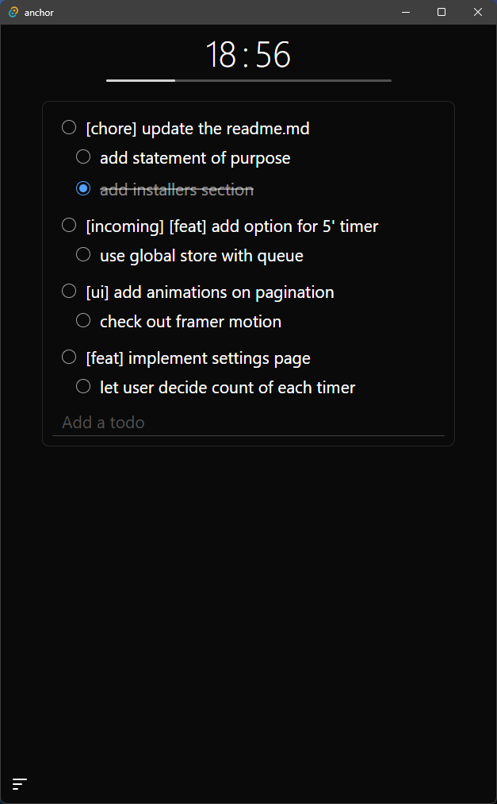

# Anchor

Latest version: 0.5.1      
Last updated: March 07, 2025

## What is Anchor?

Anchor is a minimalistic producitivity tool. The goal of Anchor is that _you_ complete your tasks. Hence, Anchor has no fancy features. Just a simple to-do list with a timer. No learning curve, no mindless distraction. A handful of screens to get you started.



## Getting Started

### For Users
Download and install Anchor using one of our supported installers:
1. Windows: [anchor_0.5.1_x64_en-US.msi](./installers/anchor_0.5.1_x64_en-US.msi)

For users on other operating systems, you're welcome to clone the repository and build Anchor locally! We encourage contributions - feel free to submit a pull request to add installer support for your preferred OS. This helps make Anchor accessible to more users.

### For Developers
1. Install dependencies:
   - [Deno](https://deno.com)
   - [Rust](https://www.rust-lang.org/tools/install)
2. Clone the repository:
   ```bash
   git clone https://github.com/abhishekppattanayak/anchor.git
   ```
3. Build locally:
   ```bash
   cd anchor
   deno task tauri dev
   ```

## Contributing
We welcome contributions! Whether it's:
- Adding installer support for other operating systems
- Improving documentation
- Fixing bugs
- Suggesting features

## Terms of Use

We have no terms of use. Anchor runs completely offline on your device. No cloud services. No data collection. No tracking. No ads. Not even a database. NOTHING. Everything is stored in memory of your device.

## Tech Stack
- JS Runtime: [Deno](https://deno.com)
- Framework: [Tauri](https://tauri.app)
- Frontend: [Solidjs](https://www.solidjs.com)
- Styling: [TailwindCSS](https://tailwindcss.com)
- Backend: [Rust](https://www.rust-lang.org)

## License

[MIT License](https://wikipedia.org/wiki/MIT_License)

(Feel free to use this code in your own projects. If you do, please let me know. I'd love to see what you've done with it.)

## Contact
Found a bug? Have a question? Create an issue on GitHub or reach out at [your-email/contact]
